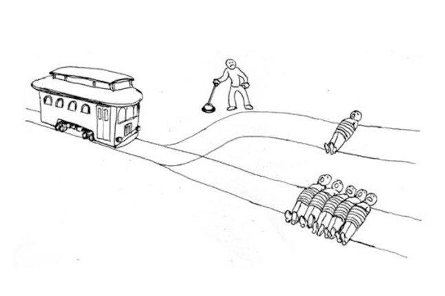
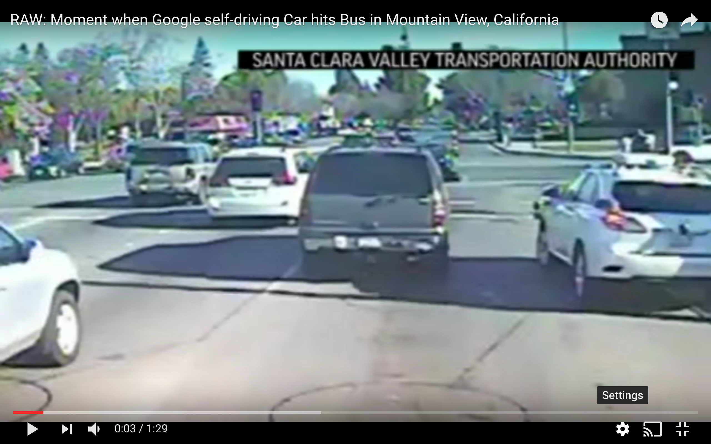

# The Ethics of the Internet of Things

## Emily Gorcenski

@EmilyGorcenski

Note: Introduce talk. Why ethics at a JavaScript conference?

---

### Content Warnings

Frank talk of injury and death

Discussion of sexual assault

Image of raw meat

Note: Cover the content warnings!

---

### Who am I?

Senior Data Scientist

Mathematician &amp; Engineer

Aerospace, Biotechnology, Finance

Note: Current career in data science, mostly writing python. But formal background in engineering and regulated industries gives unique perspective on the applications of ethics and regulation.

---

### The Internet of Things
Putting the internet into ordinary devices and services

Note: What is is the IoT? Putting the internet where it doesn't normally belong. Many things had computers, but connectivity and *consumer access* changes the game. GO DOWN.

vvv

<a style="font-size: 14pt" href="https://www.amazon.com/Zojirushi-BB-CEC20-Supreme-2-Pound-Loaf-Breadmaker/dp/B002XVUAOU">https://www.amazon.com/Zojirushi-BB-CEC20-Supreme-2-Pound-Loaf-Breadmaker/dp/B002XVUAOU</a>

Note: inside JavaScript bread baking joke

---

### Ethics

<a style="font-size: 14pt" href="http://nymag.com/selectall/2016/08/trolley-problem-meme-tumblr-philosophy.html">http://nymag.com/selectall/2016/08/trolley-problem-meme-tumblr-philosophy.html</a>

Note: introduce ethics via self-driving cars, trolley meme. Highly popular, makes for problem we can conceptualize academically and also dank memes. GO DOWN.

vvv

<blockquote class="twitter-tweet" style="width: 1000px" data-lang="en">
Why do people think the trolley problem is critical for self-driving cars? The trolley problem wasn&#39;t critical even for trolleys.
&mdash; Andrew Ng (@AndrewYNg) <a href="https://twitter.com/AndrewYNg/status/791648421291528197">October 27, 2016</a></blockquote>

Note: Frame previous slide in terms of absurdity. GO DOWN.

vvv

<!--
Ethical dilemmas occur when we encounter competing ethical frameworks.

 -->

We don't often face true ethical dilemmas in tech.

 

We just act without ethics.

Note: Core takeaway here. Ethical dilemmas happen when we have competing ethical frameworks. JS Community had one of the most interesting ethical dilemmas in tech in a long time! Comment about absense of ethics not an indictment, but rather an observation of a praxis without a backing code of professional ethics or regulation.

---

In practice, ethics are about the analysis of harm and the mitigation of risk.

Note: So what is ethics about in those fields I talked about? The engineering process by which we evaluate potential harms and the work we do to actively mitigate risk and provide remediation.

---

Harm happens in three ways:

- Malfeasance (e.g. hacking);
- Failure (e.g. bugs);
- Edge Case (e.g. unplanned scenario).

Note: the axes of harm. Talk about Mirai in the context of the first point. First point super important but a lot of it is covered by other two.

---

 
<a style="font-size: 14px" href="https://twitter.com/AndrewX192/status/846134369584492544">https://twitter.com/AndrewX192/status/846134369584492544</a>

Note: Example of bug and how IoT world differs from webapp space

---

<video style="height: 600px" controls muted>
    <source src="images/chicken-breast.mp4" type="video/mp4" />
</video>

Note: set it up, get ready for the drop

---

In 2015, a woman in Lancaster, PA called police to report a rape. Police found her Fitbit and analyzed the data.

She was charged and convicted with making false statements.

Note: pause. Describe incident. GO DOWN.

vvv

The prosecuting attorney said the Fitbit data "sealed the deal."

 

<a style="font-size: 14px" href="http://www.pennlive.com/news/2016/04/watch_today_segment_on_how_fit.html">http://www.pennlive.com/news/2016/04/watch_today_segment_on_how_fit.html</a>

Note: This was not a spurious triviality. This was central to the case.

---

Our devices can bear witness against us without any assurance of accuracy or quality.

Note: Now we have real concerns about the surveillance potential. What is being done to ensure quality? Nothing. GO DOWN

vvv

- 2017: A man is charged with the murder of his wife based on her Fitbit motion tracking. 
<a style="font-size: 14px" href="http://www.cnn.com/2017/04/25/us/fitbit-womans-death-investigation-trnd/">http://www.cnn.com/2017/04/25/us/fitbit-womans-death-investigation-trnd/</a>
- 2016: Police use data from a smart water meter in a murder investigation. 
<a style="font-size: 14px" href="http://5newsonline.com/2016/12/28/bentonville-police-use-smart-water-meters-as-evidence-in-murder-investigation/">http://5newsonline.com/2016/12/28/bentonville-police-use-smart-water-meters-as-evidence-in-murder-investigation/</a>
  - Police also filed a warrant for Amazon Echo data in the same investigation. 
  <a style="font-size: 14px" href="http://5newsonline.com/2016/12/27/privacy-advocates-raise-concerns-over-bentonville-pds-warrant-for-amazon-echo-recordings/">http://5newsonline.com/2016/12/27/privacy-advocates-raise-concerns-over-bentonville-pds-warrant-for-amazon-echo-recordings/</a>

Note: Rattle off some recent examples

---

Who goes to jail when a device 
bears false witness?

 

Who is liable when a device 
causes an accident?

Note: bring it home with this point. Set up for Google SDC and Uber fuckups

---

 
<a style="font-size: 14px" href="https://www.youtube.com/watch?v=I9T6LkNm-5w">https://www.youtube.com/watch?v=I9T6LkNm-5w</a>

Note: Google SDC crash, first time in history (at least US) a SDC was responsible. Don't forget the next slide.

---

Google acknowledged fault:

The car "predicted that [the bus] would yield to us because we were ahead of it."

Note: also historical, first time a muni bus would have yielded.

---

<blockquote class="twitter-tweet" style="width: 1000px" data-lang="en">
So the actions of autonomous robots devising their own means to attain a task may not be subject to liability under any of theories of tort...
</blockquote>

<a style="font-size: 14pt" href="https://works.bepress.com/curtis_karnow/9/download/">The Hon. Curtis E. A. Karnow, "The application of traditional tort theory to embodied machine intelligence," The Robotics and Law Conference, Stanford, CA, 2013</a>

Note: legal challenges. What does this mean for us as developers? Are we OK with living liability free?

---

left-pad

Note: bring it home with left-pad. Most interesting ethical dilemma in a decade. Challenges in IoT context.

---

### What do we do?

Set expecations with your boss

Prepare to say no

Hold frank discussions with coworkers

Know your limit

---

Thank you!

@EmilyGorcenski
